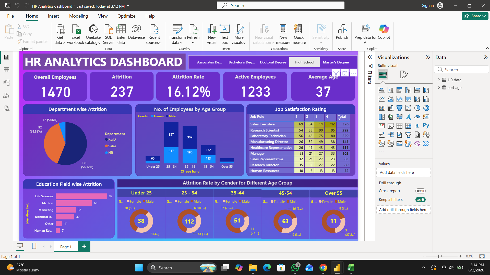

# HR Analytics Dashboard

## Project Overview
This project analyzes employee attrition, workforce demographics, and job satisfaction using Power BI.

## Tools Used
- Power BI
- SQL
- Excel / CSV
- Data Visualization

## Key Insights
- Attrition Rate: 16.12%
- Total Employees: 1470
- Active Employees: 1233
- Department-wise attrition analysis
- Job satisfaction analysis

## Files Included
- HR Analytics dashboard.pbix
- HR Data.csv
- HR_Analytics.sql
- dashboard.png
- HR-Analytics-Dashboard-Presentation.pptx

## Dashboard Preview

## Conclusion
The dashboard helps HR teams identify employee trends and make better workforce decisions.
